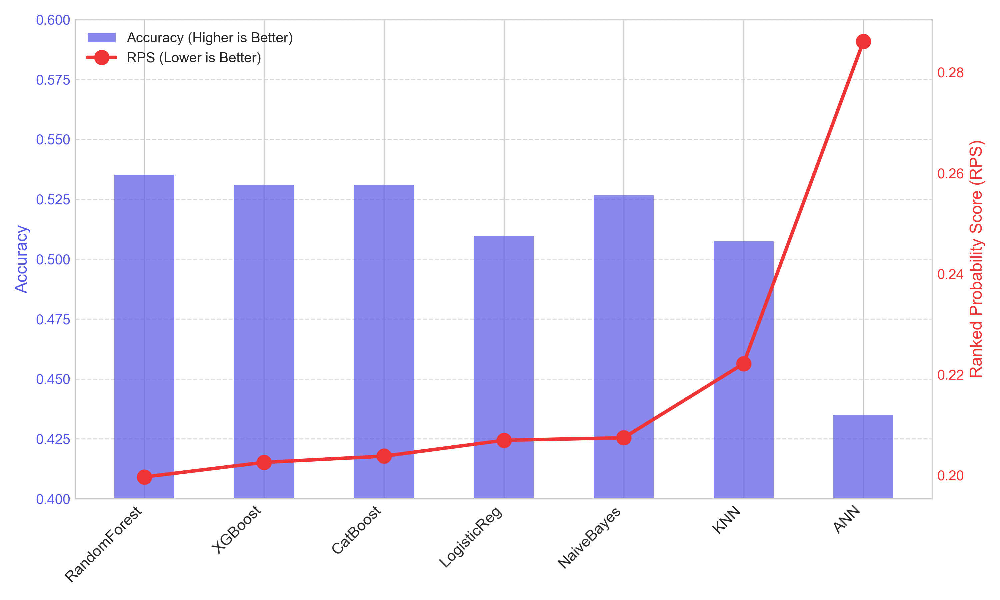
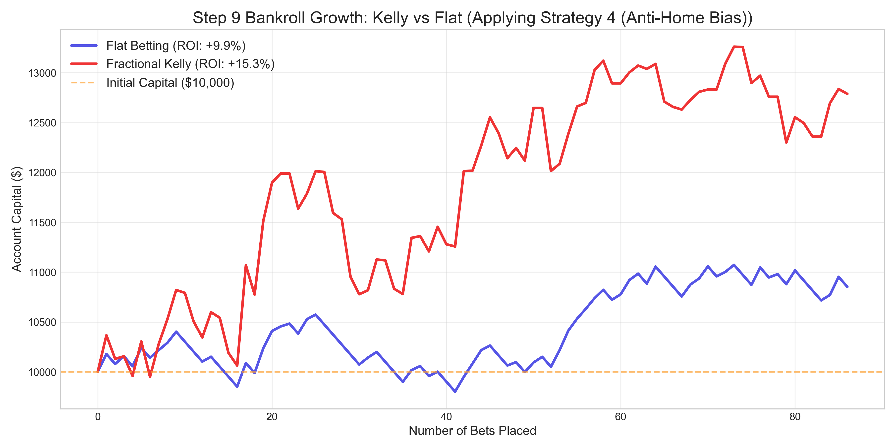

This repository contains the full implementation of Di Bao's Bachelor Thesis: **"Data-Driven Decision Making in Sports Betting: An Empirical Analysis of Machine Learning Approaches for the Outcome Prediction of English Premier League Football Matches
 "** at the Chair xAI of the University of Bamberg.

## 📝 Project Summary

This research addresses the challenge of predictive modeling and strategic capital allocation within the highly efficient English Premier League betting market. The project transitions from raw historical data to a data-driven decision-making framework, integrating machine learning with financial engineering.

**The core research question:** Can a machine learning ensemble, combined with systematic bankroll management, identify profitable strategies in the sports betting market?

To answer this, I developed a multi-stage pipeline:
1.  **A Feature Engineering Process with a Dual-Track Feature Selection Mechanism:** Including multiple feature engineerings to capture team momentum and selecting the features with RFE and PCA.
2.  **Multi-Model Evaluation:** Using Random Forest model, achieving a Ranked Probability Score of 0.1997.
3.  **An Empirical Comparison of Betting Strategy Profitability:** Analyzing variable methods to find the best way to capture value bets.
5.  **Back-Testing with Dynamic Capital Management:** Through the Fractional Kelly Criterion, converting probabilistic edges into sustainable 15.3% ROI, while strictly controlling Maximum Drawdown.
6.  **Walk-Forward Validation framework:** To simulate a realistic investment environment.

Several findings emerged from the pipeline. Random Forest model successfully captured complex tactical patterns and matched the efficiency of multi-billion dollar bookmaker benchmarks. The integretion strategy focuses on the most likely outcomes through a specialized value filter, achieved a 9.9% ROI while maintaining a low maximum drawdown of -7.3%. Fractional Kelly Criterion functioned as a dual-action engine: it compounded absolute returns and acted as a secondary quality filter by rejecting negative-expected-value bets, ultimately elevating the system’s ROI to 15.3%.
The results demonstrate that while the betting market is largely efficient, systematic algorithmic approaches can yield risk-adjusted returns that showed great potential in sports betting.

## 🚀 Key Features
- **Advanced Feature Engineering:** Integration of Elo Ratings, Offensive/Defensive Modeling and dynamic rolling features.
- **Model Benchmarking:** Comparison of multiple machine learning models.
- **Financial Framework:** Implementation of the process of exploring betting strategies and a walk-forward validation framework.

## 📊 Empirical Results

- **Predictive Performance**
  
*Figure 1: Comparison of RPS and Accuracy across different classifiers. Random Forest exhibits the highest predictive density with an RPS of 0.1997 and an accuracy of 53.52%.*

- **Strategy Backtesting**
  
*Figure 2: Cumulative returns under improved Strategies. The Fractional Kelly Criterion demonstrates superior risk-adjusted returns and capital preservation compared to flat betting.*

## 📁 Repository Structure
- `data_cleaning.ipynb`: Pre-processing of historical matches.
- `feature_engineering.ipynb`: Creation of feature engineerings.
- `feature_selection_analysis.ipynb`: RFE and PCA dimensionality reduction / model evaluation / Financial simulation and ROI analysis

## 🛠️ Installation
1. Clone the repo: 
   git clone https://github.com/DeanB930/bechelor_thesis.git
2. Install dependencies: 
   pip install -r requirements.txt
   
## 📜 License
This project is licensed under the MIT License - see the LICENSE file for details.

## 🎓 Academic Contact
Author: Di Bao 
Institution: Otto-Friedrich-University Bamberg
